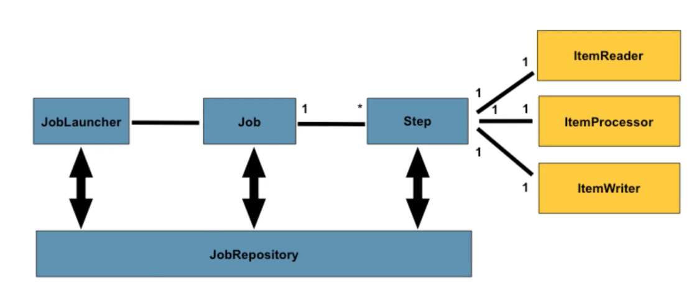

# 스프링 배치
- 인프런/[스프링 배치 입문] 예제로 배우는 핵심 Spring Batch 강의의 예제
- dataSource를 동적으로 선택하는 데이터 이관용 배치 예제

## 개요

### 스프링 배치로 작업이 필요한 이유
- 데이터를 읽고 쓰는데에 풍부한 기능이 제공되므로 비즈니스 코드에 집중할 수 있다.
- 일관성된 코드를 유지할 수 있다.
    - read, write와 같은 작업의 순서가 정형화가 되어있다.
    - 롤백과 같은 기능이 제공된다.
- 스프링프레임워크와의 호환성

### 구조

- JobRepository
    - 배치가 수행되는 메타데이터를 관리한다.
    - 시작시간, 종료시간, job의 상태 등 배치 수행 관련 데이터들이 저장된다.
- JobLauncher
    - job을 실행시켜주는 역할
- Job
    - 하나의 배치 작업
    - Job 아래 Step이 여러 단계가 올 수 있다.
- Step
    - 세부작업이 처리되는 곳